# DevDeck on Windows

The Windows shell is a WPF client for protocol v2. `DevDeckEngineHost` owns all product decisions
and state. The shell reports displays and user interaction, applies panel frames, draws card models
and returns commands without changing their JSON.

## Build and test

Windows 11 22H2 or later, Swift 6.4 and the .NET 10 SDK are required.

```powershell
swift build --jobs 1
dotnet build Windows/DevDeck.Windows.slnx --configuration Release -warnaserror
dotnet run --project Windows/DevDeck.Shell.Tests --configuration Release --no-build
Tools/Build-WindowsShell.ps1
```

The build script writes a self-contained package to `dist/windows-x64`. It contains the shell, the
engine host, the process host and Swift runtime libraries. Test assemblies are excluded.

## Deterministic replay

Replay reads protocol events from a golden transcript instead of starting the engine. It performs
no network request and reads no token.

```powershell
dotnet run --project Windows/DevDeck.Shell -r win-x64 -- --replay Tests/EngineTests/Golden/session-en.expected.jsonl
dotnet run --project Windows/DevDeck.Shell -r win-x64 -- --replay Tests/EngineTests/Golden/session-ru.expected.jsonl
dotnet run --project Windows/DevDeck.Shell -r win-x64 -- --replay Tests/EngineTests/Golden/runtime-menu-en.expected.jsonl
dotnet run --project Windows/DevDeck.Shell -r win-x64 -- --replay Tests/EngineTests/Golden/runtime-menu-ru.expected.jsonl
dotnet run --project Windows/DevDeck.Shell -r win-x64 -- --replay Tests/EngineTests/Golden/runtime-banners-en.expected.jsonl
dotnet run --project Windows/DevDeck.Shell -r win-x64 -- --replay Tests/EngineTests/Golden/runtime-banners-ru.expected.jsonl
dotnet run --project Windows/DevDeck.Shell -r win-x64 -- --replay Tests/EngineTests/Golden/session-settings-en.expected.jsonl
```

Screenshots must use these neutral golden sessions.

English replay:

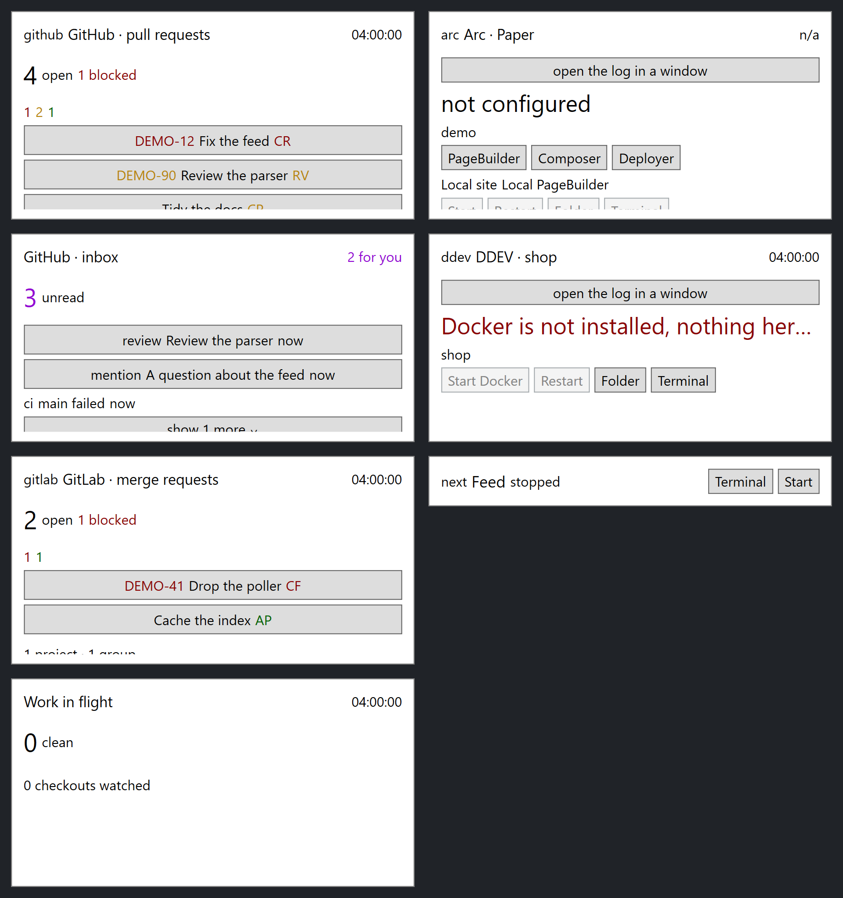

Russian replay:

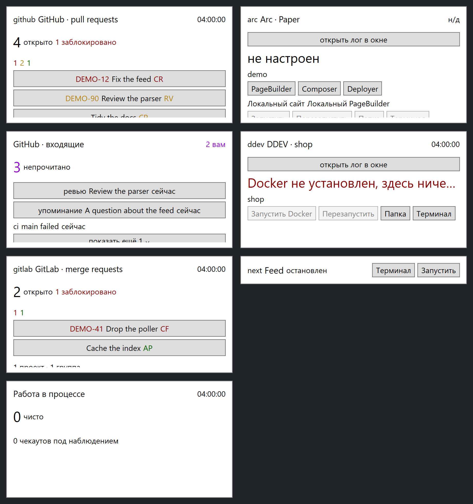

The style reference replay uses the final GitHub review model and the plain project model from
the English golden session. It adds only the engine-owned `meta.place` values needed to show the
Windows and WSL variants:

```powershell
dotnet run --project Windows/DevDeck.Shell -r win-x64 -- --replay docs/poc/windows-ui/windows-style-sample.jsonl
```

The left side of each comparison is the accepted HTML mock. The right side is the WPF renderer
at the same scale. Both sides draw cards at 352 device-independent pixels with 16 pixel side
padding, 14 pixel top and bottom padding, a 20 pixel header, 30 pixel list rows and the typography
specified in `docs/windows-style.md`:

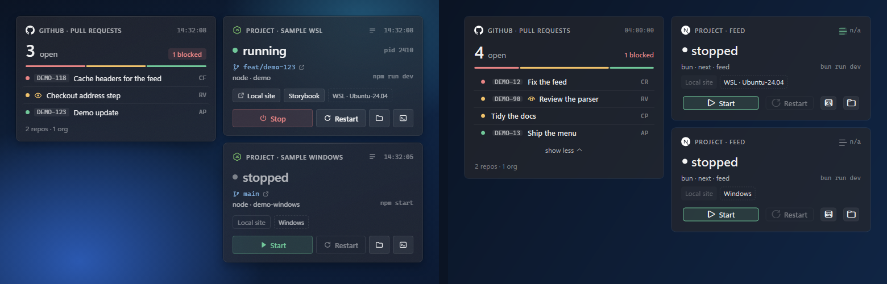

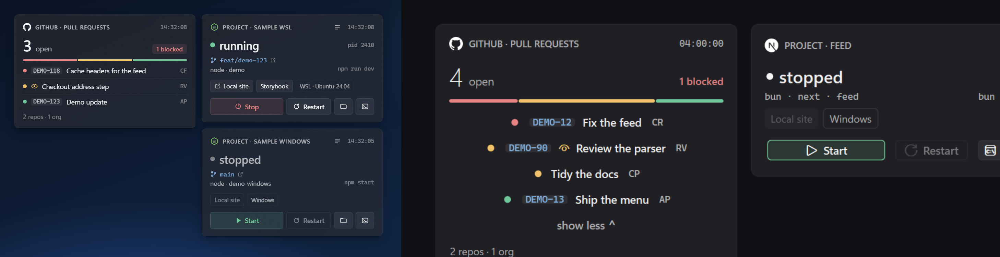


Live Acrylic and the solid fallback use the same neutral replay data:

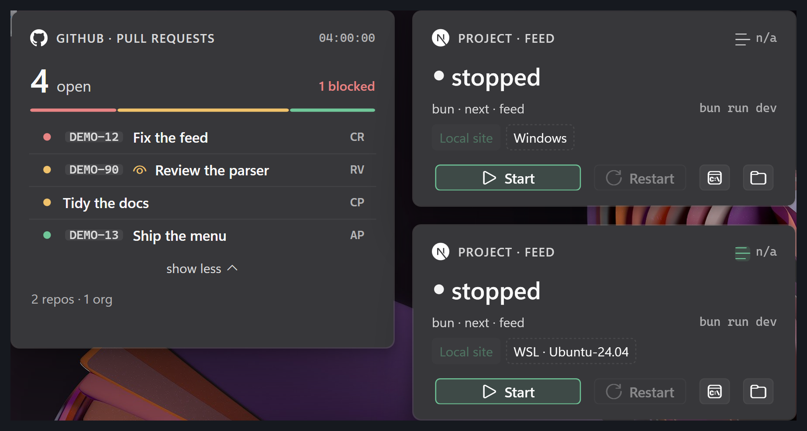

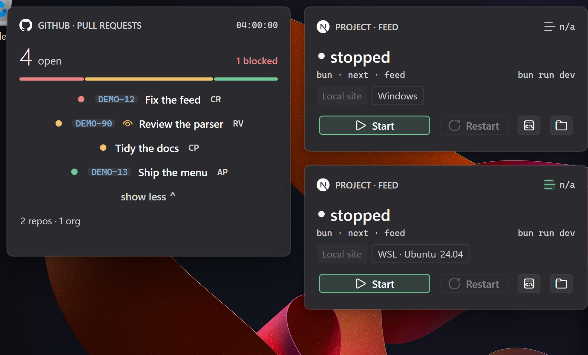

The W-4 captures contain every distinct state supplied by the English golden session. Each file
keeps one card kind together so it can be compared with the matching Mac capture on the same
data:

| Card | Windows capture |
|---|---|
| GitHub pull requests | [w4-github-pull-requests.png](../docs/poc/windows-ui/w4-github-pull-requests.png) |
| GitHub inbox | [w4-github-inbox.png](../docs/poc/windows-ui/w4-github-inbox.png) |
| GitHub Actions | [w4-github-actions.png](../docs/poc/windows-ui/w4-github-actions.png) |
| GitLab merge requests | [w4-gitlab-merge-requests.png](../docs/poc/windows-ui/w4-gitlab-merge-requests.png) |
| Work in flight | [w4-work-in-flight.png](../docs/poc/windows-ui/w4-work-in-flight.png) |
| Arc project | [w4-arc-project.png](../docs/poc/windows-ui/w4-arc-project.png) |
| DDEV project | [w4-ddev-project.png](../docs/poc/windows-ui/w4-ddev-project.png) |
| Plain project | [w4-plain-project.png](../docs/poc/windows-ui/w4-plain-project.png) |
| Collapsed cards | [w4-collapsed-cards.png](../docs/poc/windows-ui/w4-collapsed-cards.png) |

The shared button template gives every control a two-stroke keyboard focus indicator and distinct
hover, pressed and disabled states. Each state is captured separately from the neutral golden
project card.

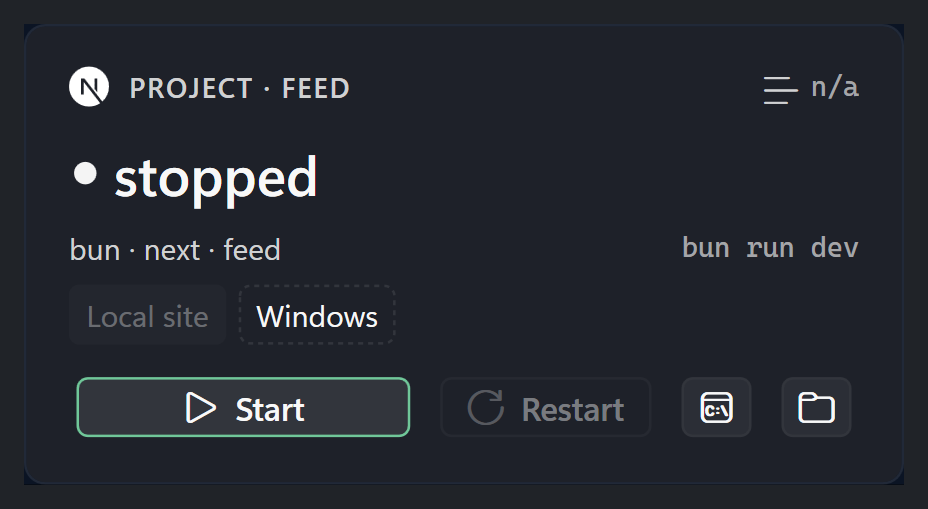

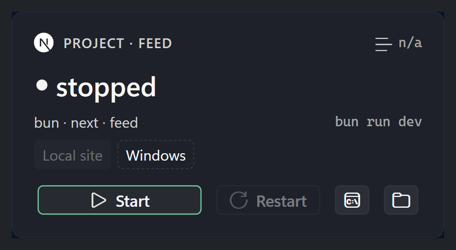

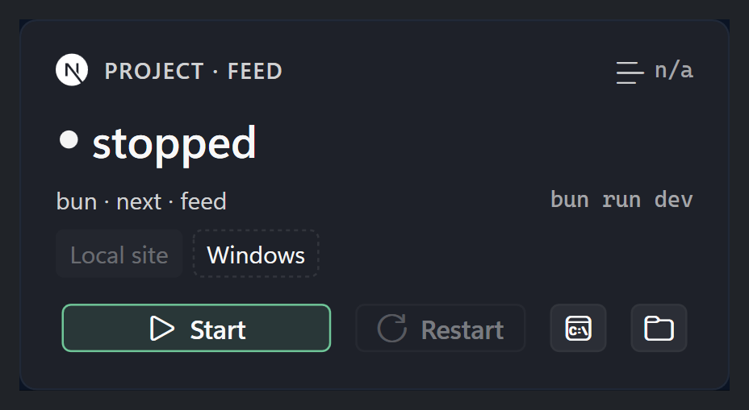

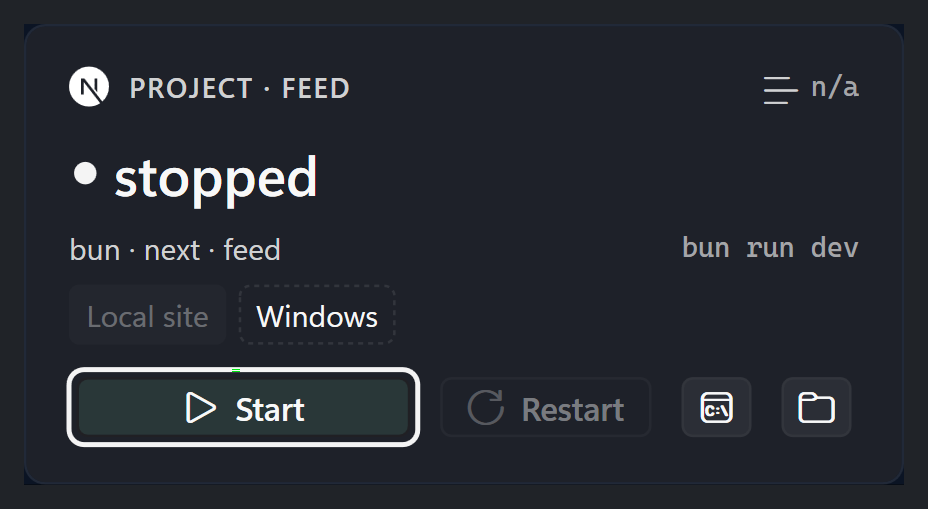

The runtime menu replays drive the same tray and menu renderer as the live host. The menu keeps
the engine supplied order, words, marks, attention tiers, alternates, checks and submenus. Card
menus use that renderer on right click. Confirmation and prompt dialogs also use only the words
in the menu model.

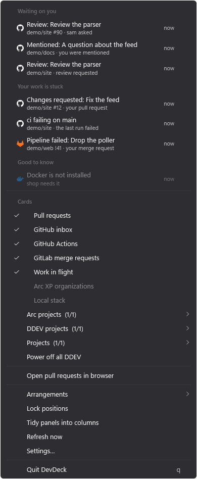

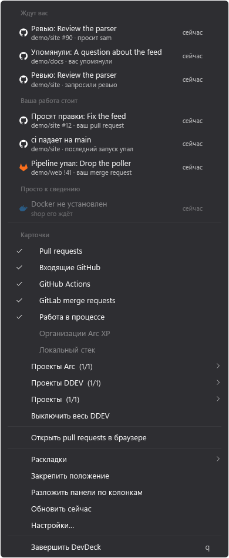

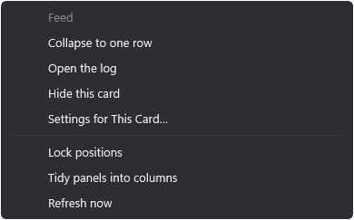

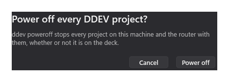

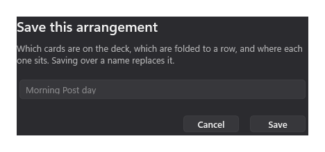

The tray mark has 16 and 32 pixel icon frames. It follows the taskbar theme and draws the engine
supplied tier. Tier 3 uses the calm mark because it does not ask for immediate action.

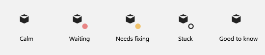

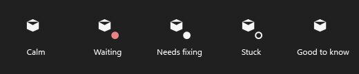

The shell posts every `notify` model as a Windows toast. The title, subtitle, body, quiet flag,
source mark and command come from the engine. Repeated ids stay quiet for the lifetime of the
shell, including engine restarts. The capture renderer below uses the same engine models and
shared vector marks; Windows supplies the final system chrome on the live toast.

This is a real Windows toast from the unpackaged shell, using neutral golden data:

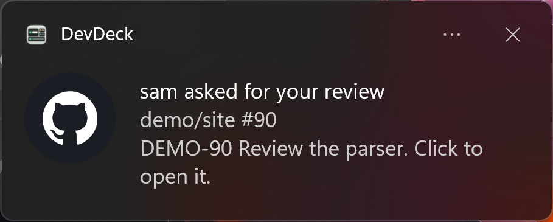

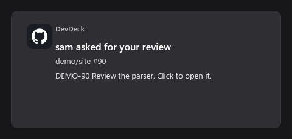

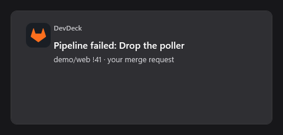

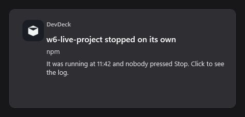

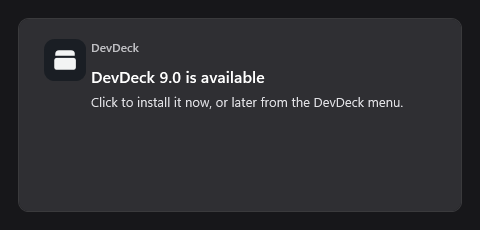

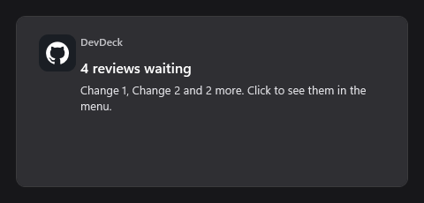

The project log opens in one normal Windows window per card. Its title, lines, source and empty
detail come from protocol v2. New tail lines are appended without rebuilding the existing visual
rows. The view follows the end until it is scrolled up, and Ctrl+F filters and highlights matches.
Window size and position are kept in `%LOCALAPPDATA%\DevDeck\shell-log-windows.json`.

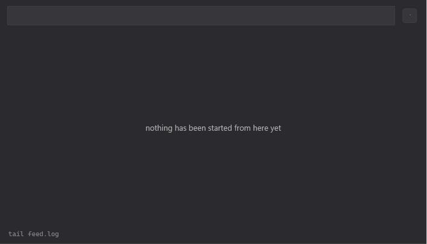

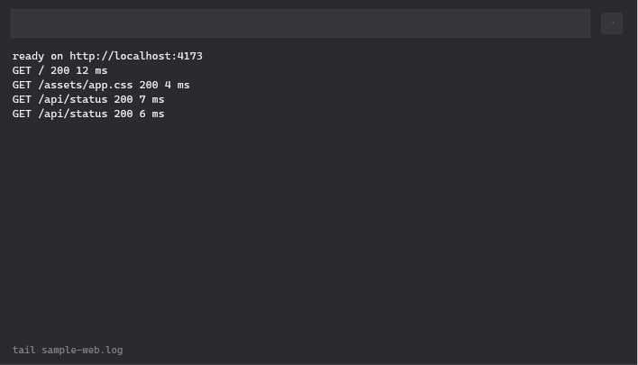

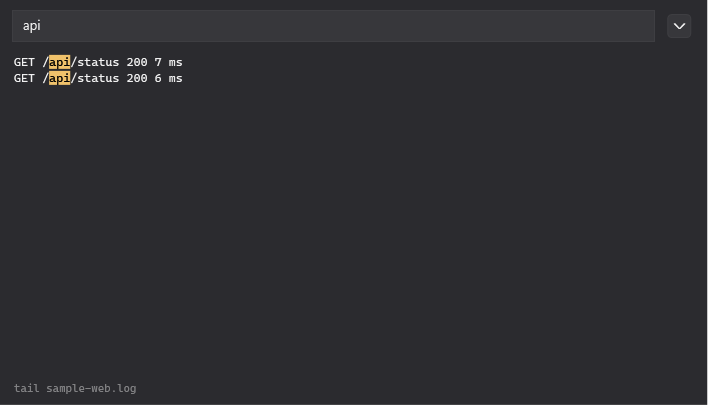

## Toast registration

The unpackaged shell uses the classic Windows toast API with the stable AUMID `DevDeck.Shell`.
At startup it creates or updates the current user's
`%APPDATA%\Microsoft\Windows\Start Menu\Programs\DevDeck.lnk`, points it at the running
executable and gives it the same AUMID. Windows uses that shortcut to associate notifications
with DevDeck. Activation is handled only while the shell is running, so the exact command stays
in memory and is never written to an activation argument.

Source marks are rendered as square 256 pixel PNG files in
`%PROGRAMDATA%\DevDeck\NotificationAssets`. That location lets the Windows notification renderer
read the image. The XML uses an absolute `file:///C:\...` source. The executable embeds the
DevDeck app icon, which is also used by the Start Menu shortcut and the toast header.
The shortcut and notification asset directory are the only persistent machine state created for
notifications.

The earlier Windows App SDK 1.8 implementation called `AppNotificationManager.Register()` and
reported notifications as enabled, but Windows Shell did not display or retain them. This matches
[Windows App SDK issue 6821](https://github.com/microsoft/WindowsAppSDK/issues/6821). The classic
API and Start Menu shortcut work for both `dotnet run` and the self-contained output of
`Tools/Build-WindowsShell.ps1`.

## Backdrop behavior

The Windows 11 test confirms that a borderless WPF window receives the system backdrop when
`AllowsTransparency` stays false. DevDeck extends the DWM frame through the whole client area,
keeps the WPF composition target transparent, sets `DWMWA_SYSTEMBACKDROP_TYPE` to
`DWMSBT_TRANSIENTWINDOW`, opts into dark mode and asks DWM for rounded corners. On the tested
machine DWM returned backdrop value `3`, dark mode value `1` and corner preference value `2`.

The card surface adds the specified `#28282C` tint at 66 percent opacity. When Windows transparency
effects are off, it switches to the opaque `#2B2B2F` surface. The shell still leaves corner
clipping to DWM, so neither mode produces square corner artifacts.

## Live development

Run the shell against a locally built host:

```powershell
dotnet run --project Windows/DevDeck.Shell -r win-x64 -- --engine .build\out\Products\Debug-windows-x86_64\DevDeckEngineHost.exe
```

The development commands add and remove a local project through the engine settings operation and
print the matching protocol answer:

```powershell
dotnet run --project Windows/DevDeck.Shell -- --add-project C:\projects\sample-api
dotnet run --project Windows/DevDeck.Shell -- --add-project \\wsl.localhost\Ubuntu-24.04\home\developer\sample-web
dotnet run --project Windows/DevDeck.Shell -- --remove-project project.sample-api
```

The host stores tokens in Windows Credential Manager. The shell contains no token storage code and
never reads a token.

## Displays and coordinates

The shell sends monitor work areas, panel measurements and panel frames in one virtual desktop
coordinate system. Its unit is a DIP on the primary monitor, with the origin at the virtual
desktop's primary monitor and y increasing downward. Windows reports monitor work areas in
physical pixels, so the shell divides every coordinate by the primary monitor scale at the
protocol boundary. A
panel on another monitor still renders with that monitor's scale because the manifest selects Per
Monitor V2 awareness. The reverse conversion happens once when the shell applies a frame from the
engine.

After applying a native panel frame and after `WM_DPICHANGED`, the shell recalculates the WPF
window size from primary monitor DIPs and the window's current DPI. The native frame and WPF
layout therefore stay at 352 local DIPs when a panel moves between displays with different scales.

Each display id is the monitor device interface path returned by Windows. That path follows the
physical monitor across disconnects and reconnects, unlike names such as `DISPLAY1`. The reported
frame excludes the taskbar and other app bars, and exactly one connected display is primary.

The shell sends the complete display list after `WM_DISPLAYCHANGE`, a work area
`WM_SETTINGCHANGE`, a panel `WM_DPICHANGED`, and resume from sleep. It reports one final
`card.moved` after an unlocked user drag. Window moves caused by `panels.changed` are suppressed,
while other Windows initiated moves are reported after the corresponding display event when one
is available. The engine owns the settling delay, parking, restoring and Tidy placement.

The live check used a 250 percent primary display and a 100 percent external display. Two cards
were dragged to the external display, aligned there with Tidy, and restored there after restarting
the shell. Disconnecting the external display parked both cards in a free column on the primary
display at the primary scale. Reconnecting it restored their previous positions. Sleep and resume
kept both stable display ids and all panel frames, without a move reported for the system shift.

These captures use the WPF renderer with neutral golden data. The connected capture presents both
display scales in one canvas. The disconnected capture shows the same two cards parked without
covering the cards already on the primary display.

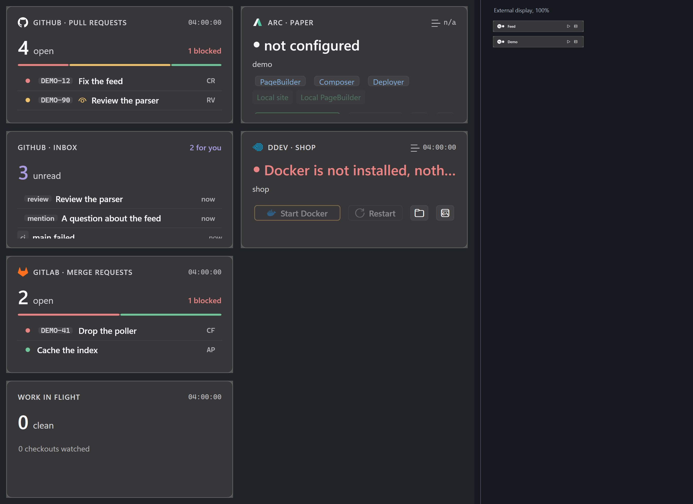

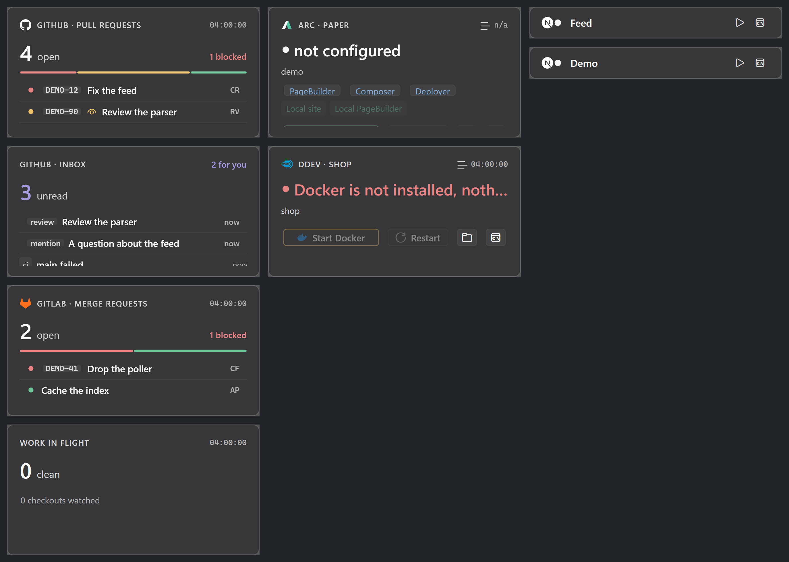

The DPI hotfix acceptance uses real full desktop captures from Snipping Tool with the golden
session models. The first capture shows three cards opened directly on the 100 percent external
display. The second shows the Work in Flight card after a live drag from the 250 percent primary
display to the external display. Each card keeps a 352 DIP width and complete content at its local
scale.

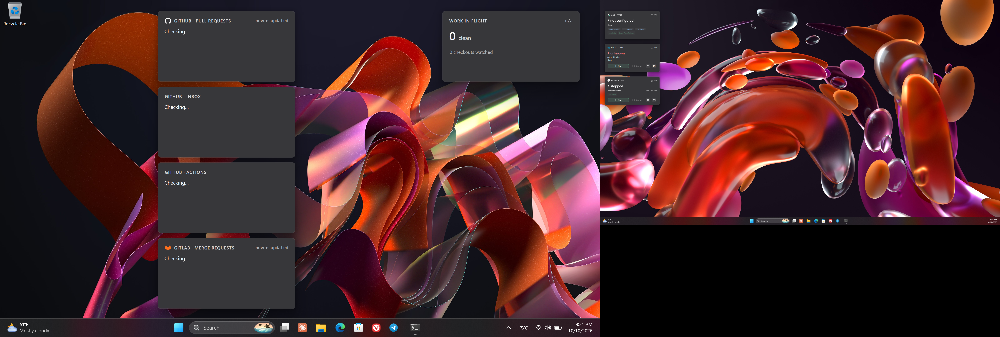

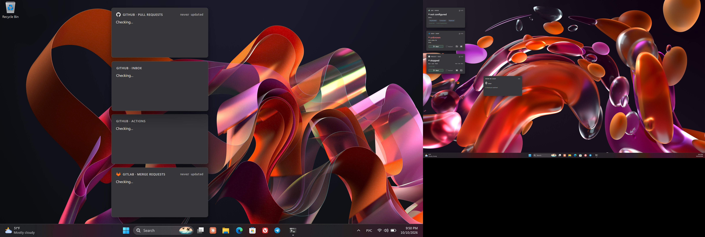

## Summon

The shell asks the engine for deck preferences when a session starts and after every preferences
answer. `summonEnabled` controls whether Summon can raise the deck, `summonDims` controls the
veils, and `summonShortcutWindows` supplies the global shortcut. A missing shortcut uses
`Ctrl+Shift+Space`. Windows reserves `Alt+Space` for the active window's system menu and most
Windows key combinations for the shell, so the default uses neither.

The shortcut is registered with `RegisterHotKey`. The shell does not install a keyboard hook and
does not choose another shortcut when registration fails. It writes the Windows error to standard
error and keeps running. `GetAsyncKeyState` observes release of the shortcut's main key because
`WM_HOTKEY` reports only the press.

A press raises every card to the topmost layer. Releasing it after 0.25 seconds returns the cards
to the layer from `deck.displayMode`; a shorter tap keeps them raised until the next press, Escape
or a click on the dimmed area. The 0.25 second value mirrors
`DeckRuntime.summonLatchThreshold` until the protocol carries it. The `present` effect uses the
same latched state.

When dimming is enabled, each raise creates one nonactivating black window at 30 percent opacity
for every monitor work area. The taskbar remains uncovered so Start and taskbar controls still
work. The veils are placed below the topmost cards and are discarded when Summon ends, so a new
raise uses the current monitor list.

The live check used a 250 percent primary display and a 100 percent external display. Both veils
matched their complete monitor work areas. The cards stayed above them without taking focus, and
Start and Alt+Tab continued to work. Escape returned all cards to their previous layer.

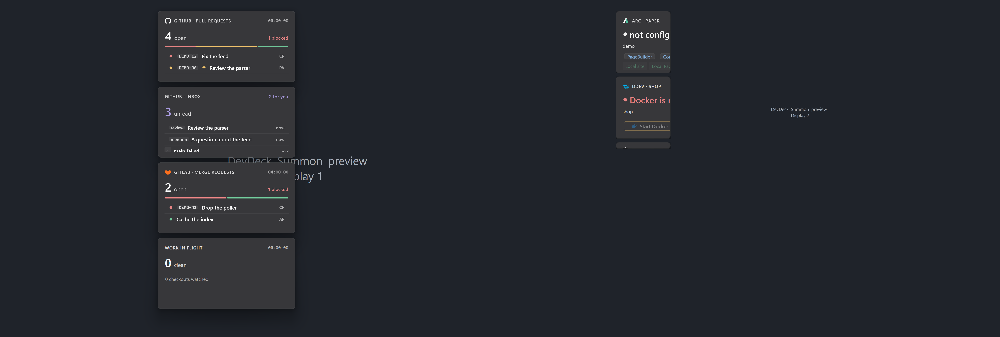

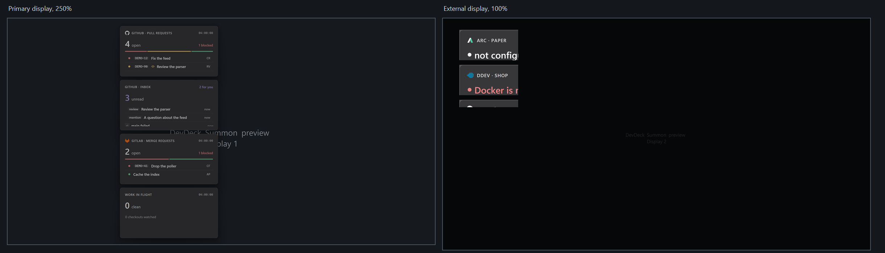

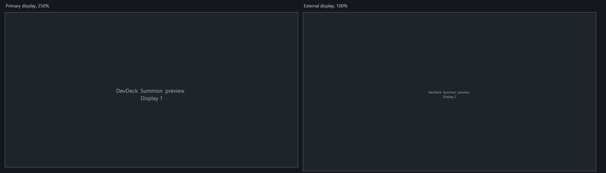

## Settings

The `openSettings` effect opens one reusable settings window. Its navigation, forms, status rows,
dialogs and controls use the `words`, `list`, `cards`, `preferences` and record answers from the engine.
Requests keep their protocol id until the matching `settings.answered` arrives, so a slow check
for one record cannot update another form. A preferences answer asks for `words` again because
the language may have changed.

The Cards page sends `setCard` and replaces its rows with the returned `cards` answer. A missing
Windows Summon shortcut displays `SummonShortcut.DefaultText`, while Default stores nil. Token
page links send `openGitHubTokenPage` or `openGitLabTokenPage`; the engine supplies the resulting
`openURL` effect.

The token field is a `PasswordBox`. Save moves its text into one `checkGitHubToken` or
`checkGitLabToken` request, clears both the control and its form buffer, and never reads the token
back. The engine continues to own Credential Manager storage. Project location labels use the
engine's `project.place.windows` and `project.place.wsl` words. The shell only extracts a WSL
distribution name from the UNC path.

Browser fields list applications registered under `SOFTWARE\Clients\StartMenuInternet` and
store that registry key as the protocol identifier.
Edge, Chrome, Brave and Vivaldi get a second profile picker from the browser's `Local State`
file in Local AppData. Firefox and other browsers have no profile picker. The replay source for
settings screenshots
is [`windows-settings-sample.jsonl`](../docs/poc/windows-ui/windows-settings-sample.jsonl). It was
recorded from a live host in an isolated profile with neutral account and project names.

## Links, folders and the phone

An `openURL` effect with no browser uses the Windows default association. An explicit browser is
resolved from its Start Menu Internet registry entry. Chromium choices pass
`--profile-directory=<directory>` before the URL when the engine supplies a profile. The shell
keeps the Local State path table because Windows does not publish those vendor paths in the
registry. The table currently covers Edge, Chrome, Brave and Vivaldi.

`openTerminal` uses `wt.exe -d <folder>` for a Windows folder. Without Windows Terminal it opens
`cmd.exe /K cd /d <folder>`. A `\\wsl.localhost\<distribution>\...` or
`\\wsl$\<distribution>\...` folder becomes the Linux path seen by that distribution and opens
through `wt.exe wsl.exe -d <distribution> --cd <path>`, or directly through `wsl.exe` in a new
window when Windows Terminal is absent. `revealFolder` passes Windows and WSL paths to Explorer
unchanged.

The phone button creates its QR image locally with QRCoder 1.8.0, an MIT licensed dependency.
The popup contains only `phoneTitle`, `phoneNote` and `phoneURL` supplied by the engine. On
Windows, `LocalAddress.current()` reads IPv4 adapters through `GetAdaptersAddresses`, keeps active
physical adapters, prefers Wi-Fi and ignores loopback, Hyper-V, WSL, VPN and other virtual
adapters. Nothing is sent to a QR service.

## Start at login

The General page controls the current user's `DevDeck` string value under
`HKCU\Software\Microsoft\Windows\CurrentVersion\Run`. Its data is the current shell executable
path in quotes. The switch is on only when the stored command matches the running executable, so
moving or reinstalling the shell leaves the old entry visibly off until it is enabled again.

`DevDeck.Shell.exe --enable-login-item` writes the same value for setup scripts and the W-17
installer. The shell is a Windows GUI executable, so starting it at sign-in does not create a
console window. Developer commands attach to their parent console when one exists.

W-17 and W-18 installers must remove the `DevDeck` Run value during uninstall. Disabling the
switch removes it immediately.

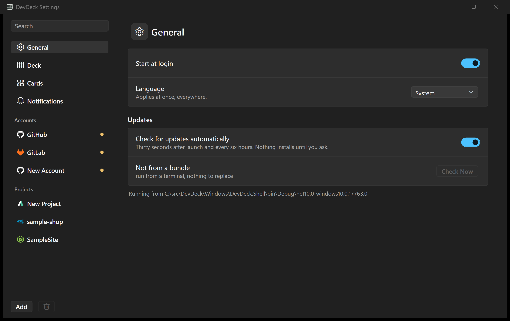

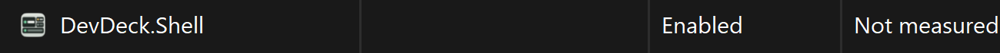

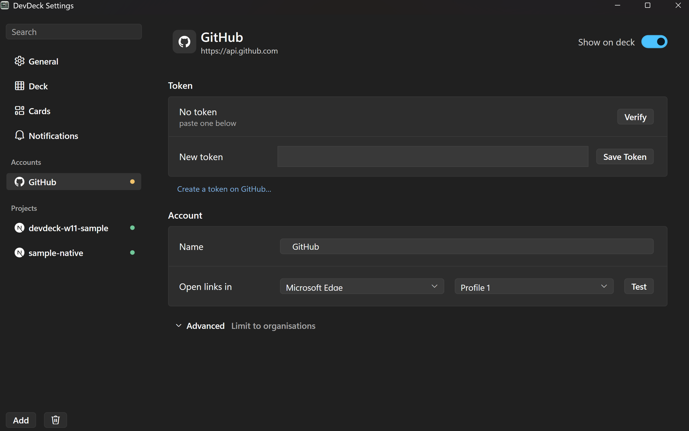

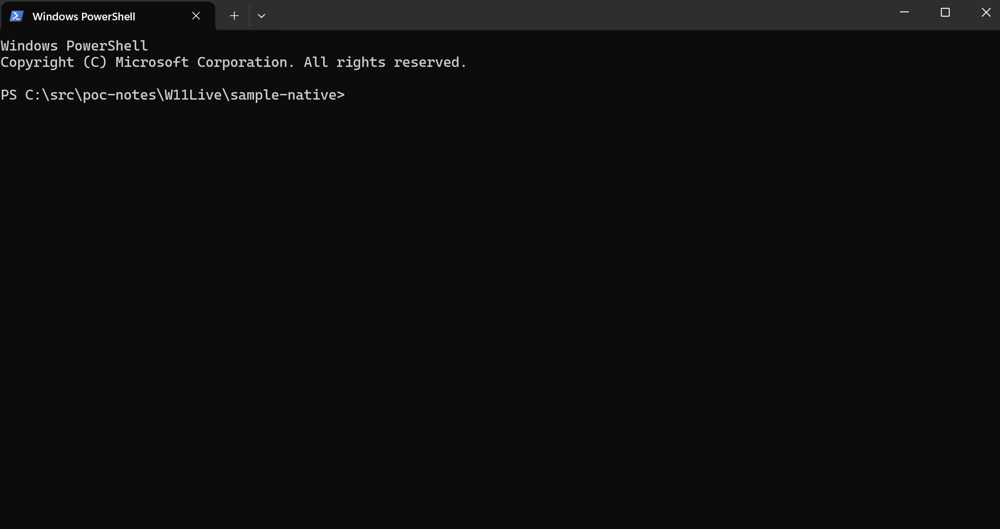

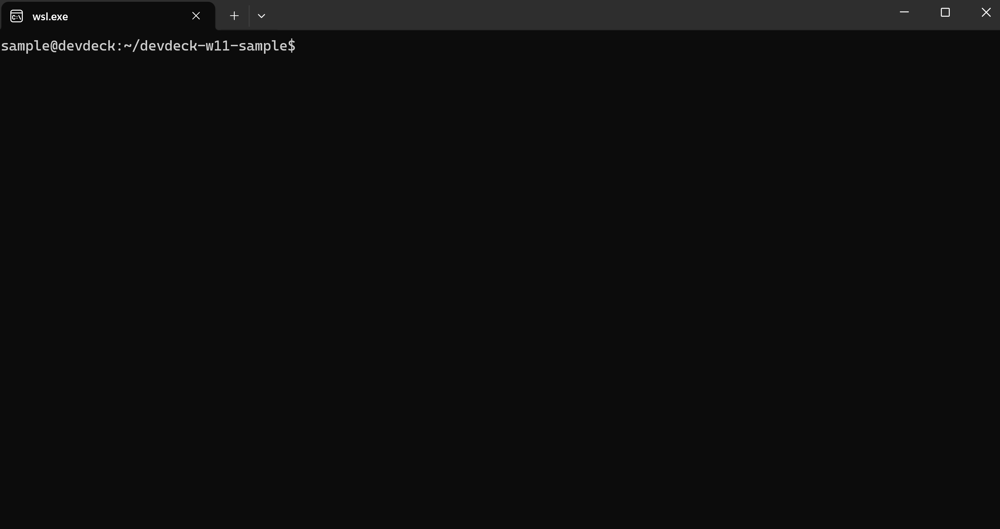

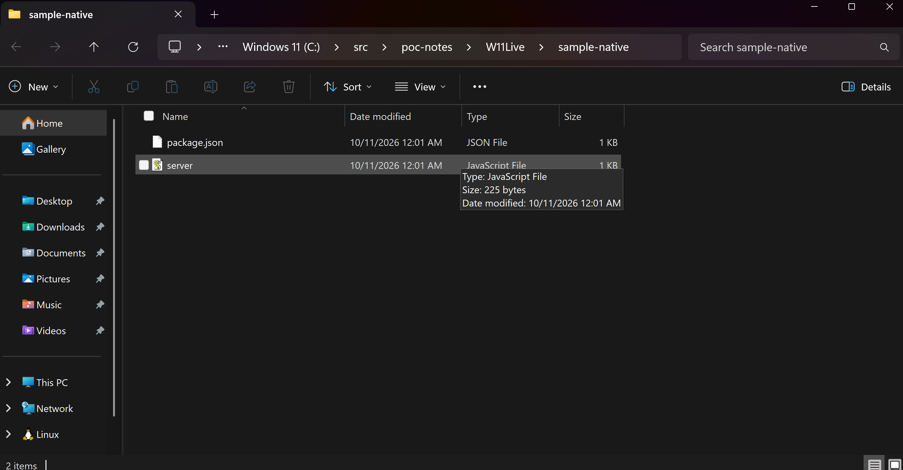

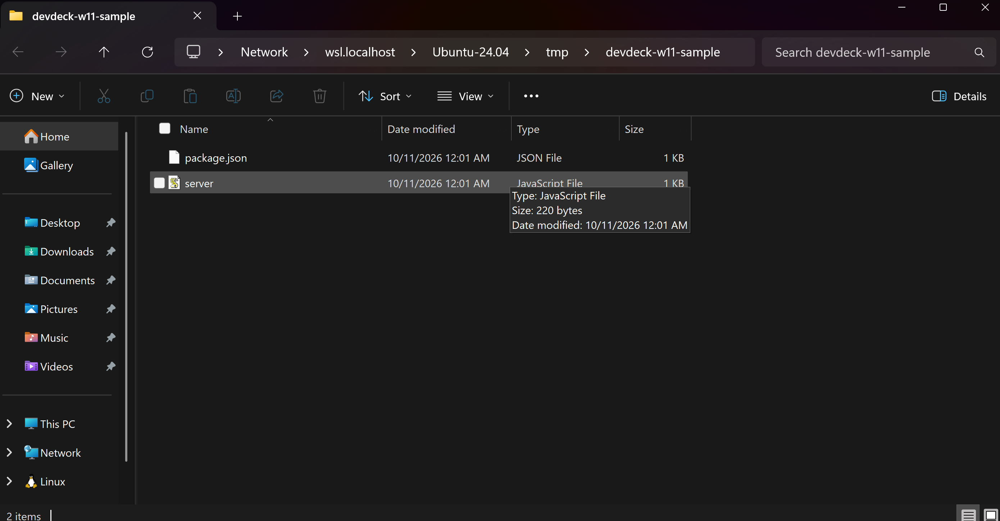

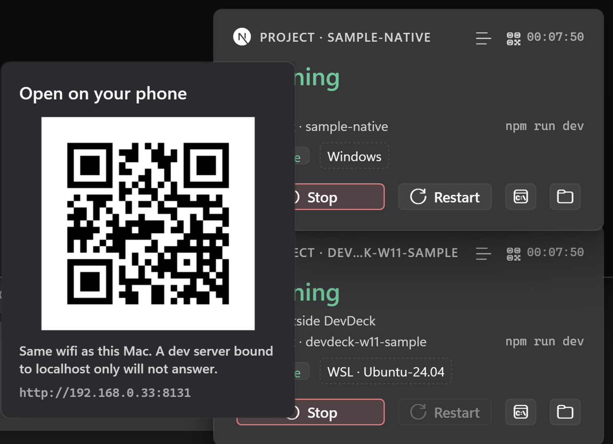

## Current boundary

The shell renders the five card model kinds and collapsed rows, applies `deck.changed` and
`panels.changed`, reports measurements, moves and display changes, executes the supported system
effects and restarts a failed host. It shows the last stopped model and stopped status while the
host is unavailable.

The tray renders `status.changed` and `menu.changed`. A menu update replaces the items in the
open menu without closing its popup. The tray and card menus return engine commands unchanged;
only a prompt fills the command's `name`. `openMenu` opens the tray menu and `quit` closes the
shell after the host stops its cycles. `openSettings` opens the engine backed settings window.

`notify` posts one Windows toast per model with the source mark from `BrandMarks.json`. Quiet
models add the system silent audio flag. A click returns the stored command without changing its
JSON. Notification ids are remembered by the shell so a restarted host cannot show the same
banner twice.

`openLogs` and `closeLogs` manage one resizable log window for each card. The shell returns
`logWindow.changed` for both engine and user initiated changes. Card highlighting still changes
only when the next `card.changed` model carries `header.logIsOn`.

Summon reads its enabled state, dimming choice and Windows shortcut from engine preferences.
The global shortcut and `present` effect raise the existing panels without activating them. A
hold is spring loaded, while a tap, Escape and a veil click use the shared latched state.

All five model kinds and collapsed rows use the Windows visual system in
[`docs/windows-style.md`](../docs/windows-style.md). Review lists cover both GitHub pull requests
and GitLab merge requests. Arc, DDEV, Windows and WSL projects share the project renderer while
keeping their engine supplied marks, chip kinds and actions. The project log control is a 24 px
icon button: `header.logHelp` is its tooltip and `header.logIsOn` is its highlighted state. The
phone icon appears only when the engine supplies `header.phoneURL`; its popup uses the engine
supplied title, note and address.

Installing an update from the `installUpdate` effect remains outside this shell milestone.
