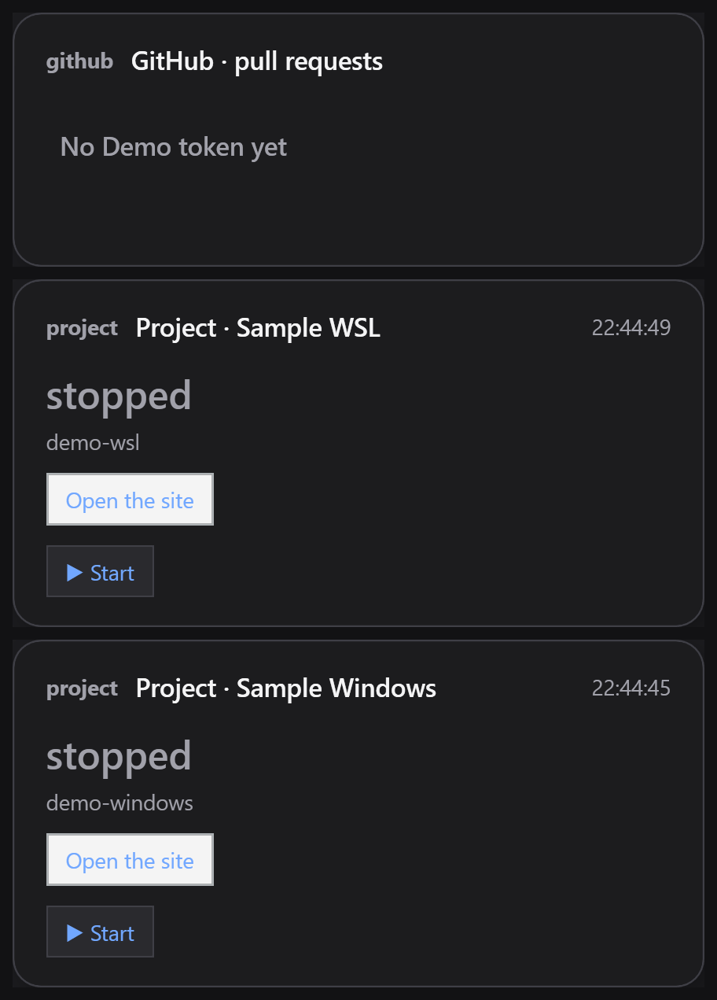
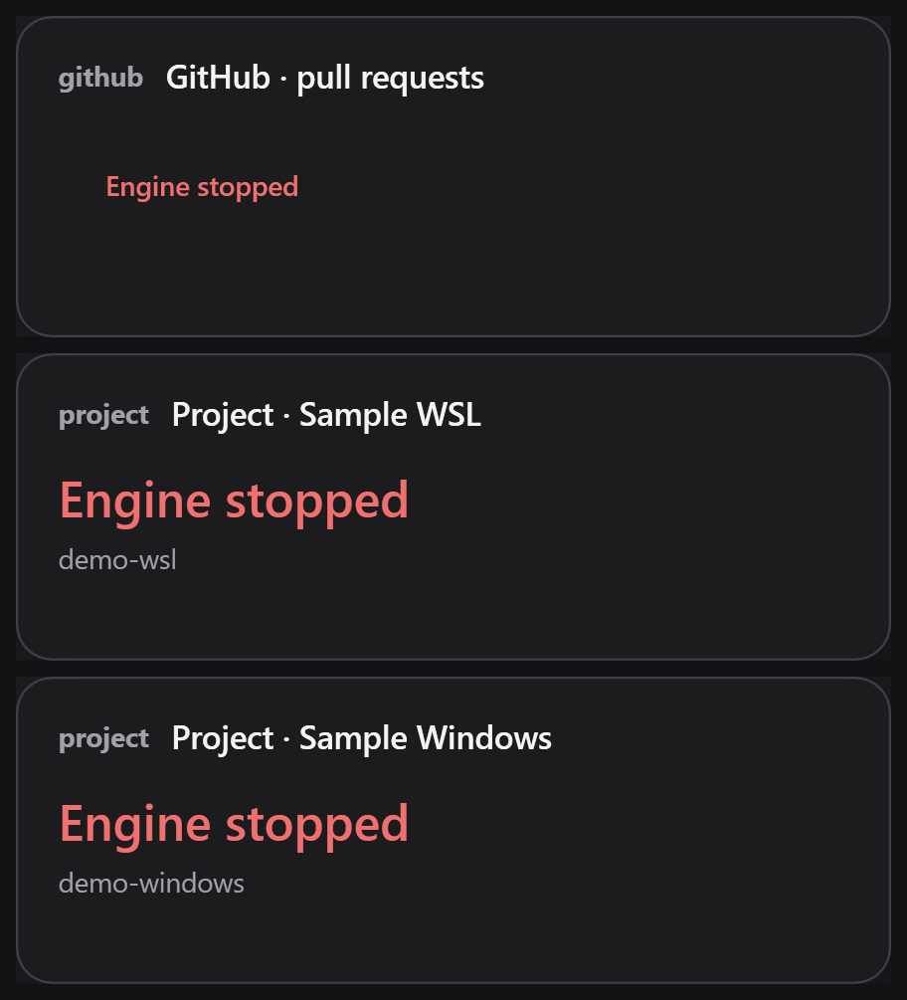

# One-engine POC report

Date: 2026-10-08. Branch: poc/one-engine. Steps 1 through 3 are accepted; step 4 is in progress.

## Answers and acceptance

| Question | Answer | Evidence or remaining gate |
| --- | --- | --- |
| Q1: native Windows core | Yes, accepted with a toolchain exception | Project code builds without warnings; Windows core tests: 8 passed, 0 failed. Swift 6.4 WinSDK warnings are external, swiftlang/swift#91000. Recheck with the release containing the fix. |
| Q2: authenticated GitHub | Yes, accepted | The user ran Invoke-NetworkSmoke.ps1 with hidden credential input and accepted Q2. GraphQL PR fetching and REST /user ETag/304 remain separate checks. |
| Q3: WSL project lifetime | Yes, accepted | Default instanceIdleTimeout, independent project WSL client, more than 5 minutes without an engine, discovery by a new engine, tree cleanup and natural distro idle shutdown. |
| Q3b: Windows folder projects | Yes, accepted | Native Node LTS Start, engine EOF survival, new-engine discovery, Job Object Stop, registry PATH refresh and WSL project isolation passed. ADR 0023 is accepted. |
| Q4: identical transcripts | Yes, accepted | All three committed scenarios are byte-identical on Windows and Mac in en and ru. |
| Q5: thin WPF shell | Implementation ready for acceptance | The self-contained .NET 10 WPF shell shows PR, WSL and Windows project cards from engine models. The user ran the hidden token command, and the scoped Credential Manager entry is present. |
| Q6: measurements | Not started | Runtime size, startup, 10-minute idle memory/CPU and mixed-DPI checks are pending. |

Recommendation: continue the native engine POC through step 4. Step 5 remains gated on Q5
acceptance. Windows ARM64 is untested.

## Environment

| Tool | Version or location |
| --- | --- |
| Windows architecture | AMD64, x86_64-unknown-windows-msvc |
| Swift | 6.4, swift-6.4-RELEASE, assertions enabled |
| Visual Studio Build Tools | 2022, 17.14.37710.0; installer package 17.14.41 |
| Windows SDK | 10.0.22621.0 |
| Git | 2.54.0.windows.1 |
| GitHub CLI | 2.102.0, authenticated by the user |
| WSL | 2.7.3.0, kernel 6.6.114.1 |
| Distribution | Ubuntu-24.04, normal Linux account initialized by the user |
| Node LTS | 24.20.0, installed through winget OpenJS.NodeJS.LTS |
| Node executable used for Q3b | C:/Program Files/nodejs/node.exe |
| Checkout | C:/src/DevDeck |
| .NET 10 SDK | 10.0.401; Windows Desktop runtime 10.0.12 |

The existing NVM Node 20.20.2 precedes the new installation in registry PATH. The neutral
live project explicitly selects the installed Node 24 executable. The runner reads machine
and user PATH from the registry on each launch and leaves the user's version-manager choice
unchanged. Dependencies follow [Swift's Windows installation instructions](https://www.swift.org/install/windows/).

## Mac evidence supplied by the user

On the Q1 patch over f8db218: run-tests.sh reported 405 passed, 0 failed; swift build had no
warnings; the Mac Package.swift branch was byte-for-byte identical to main. Q1 was accepted
with the external [Swift issue 91000](https://github.com/swiftlang/swift/issues/91000) exception.

On bb50b7b: run-tests.sh main suite reported 405 passed, 0 failed; engine tests reported
5 passed, 0 failed, with the Windows-only test skipped; swift build had no warnings;
build.sh built the application. These were run by the user on a Mac.

On b5d01d3: run-tests.sh main suite reported 405 passed, 0 failed; engine tests reported
8 passed, 0 failed; swift build had no warnings; build.sh built the application. The user
also verified that DevDeckApp and DevDeckUI were unchanged. Q2, Q3, Q3b and ADR 0023 were
accepted after these results.

On c54ed66: all three golden scenarios matched the committed files byte for byte without
UPDATE_GOLDEN_TRANSCRIPTS, and the working copy stayed clean. run-tests.sh reported 405 passed,
0 failed; engine tests reported 11 passed, 0 failed; swift build had no warnings; build.sh built
the application. The user also verified that DevDeckApp and DevDeckUI were unchanged and
accepted Q4.

The step 4 changes require a new Mac run. No Mac check for step 4 was run or claimed on this
Windows machine.

## Q2 evidence

PRs use authenticated GraphQL POST through PullRequestsService. ETag/304 is a separate REST
GET /user check. GraphQL POST is not claimed to support ETag/304. Offline unauthorized-card
checks pass in en and ru. The user ran the hidden-input helper and accepted Q2. The helper sends
the credential through stdin, uses memory only and never reads GitHub CLI credentials.

## Q3 evidence

nohup without an active WSL client failed under the default idle policy. A temporary global
instanceIdleTimeout=-1 workaround was tested, then removed at the user's request. Only
Ubuntu-24.04 was explicitly restarted; other distributions were not stopped.

The independent foreground WSL client passed two 325-second checks with no engine and
HTTP 200 on ports 8765 and 8766. The final standalone check measured 325.2892 seconds.
One WSL session used two Windows forwarding processes. A new engine reported running;
Stop left no live demo Linux processes, no listeners and no WSL clients. Ubuntu stopped
naturally after 15.763 seconds, without a terminate or shutdown command after Stop.
No global idle-policy override is required.

Cancellation and timeout checks include a child in a separate Linux session. Cleanup validates
Linux processes and process groups, rather than only the Windows wsl.exe process. PID, boot
identity, start time and kill -0 are checked in one invocation of the configured distribution.
Cold-start preparation has a separate 30-second allowance.

## Q3b implementation and evidence

Project location is derived in the engine: drive-letter folders use Windows; wsl.localhost
and wsl$ UNC paths supply their distribution; Linux paths require distribution in that project.
Configuration uses a projects array. PR, WSL and Windows project cards share one engine.
Each project has independent action, polling and smoothing state.

Windows commands use cmd.exe /d /s /c through a detached DevDeckProcessHost. The named Job
Object has no KILL_ON_JOB_CLOSE. The process host retains an inherited job handle so its name
can be reopened by a new engine. A private hidden console permits Ctrl+C from an attaching
controller without touching engine JSONL streams. Stop falls back to TerminateJobObject and
checks zero active members. PID files contain creation time, checked using a fresh process
handle and job membership; numeric handles are never persisted in those files.

The exact nested Node command from the POC, including a quoted executable path containing
spaces, started parent and child HTTP servers on 8775 and 8776. Both answered HTTP 200 after
engine EOF. A new engine found running and Stop freed both ports. Generic native timeout
and cancellation captured both Node PIDs and waited for both process handles to signal exit.
Temporary command jobs use KILL_ON_JOB_CLOSE; project jobs do not. A live PATH check replaced
the smoke process's inherited PATH with an unavailable folder, then verified that node was
found through the runner's refreshed registry PATH.

Engine EOF during startup cleaned five owned Windows processes and removed the PID record.
A startup whose health URL never answered cleaned four owned processes after its readiness
deadline and removed the record. The host uses a separate 3-second health HTTP client, keeping
GitHub request timeout independent of project readiness.

Both projects then survived 328.1293 seconds without an engine, with HTTP 200 on all four ports
and exactly two WSL forwarding processes. A new engine discovered both. Stop of Windows left
both WSL ports serving; restarting Windows and stopping WSL left both Windows ports serving.
Final Stop freed all four ports, with no owned Node processes, live demo Linux processes or
WSL clients. Ubuntu stopped naturally after 15.9557 seconds. No WSL terminate or shutdown was
used after Stop.
See [the process-lifetime decision](../adr/0023-project-process-lifetime.md).

## Q4 golden transcripts

Three scenarios keep their protocol v2 intentions and expected JSONL event streams in the
repository. They use MutableDateProvider, explicit UTC, FakeHTTPClient and StubCommandRunner
through LocalProjectService. The scenarios cover initial data and layout in English, a pull
request moving from ready to blocked in Russian, and project Start followed by Stop in English.
Tests compare the complete output as bytes without parsing or platform-specific normalization.

Windows DevDeckEngineTests report 12 passed and 0 failed, including all three byte comparisons.
The user supplied the matching Mac result on c54ed66 and accepted Q4.

For phase 1 after the POC, project launch behavior should move out of LocalProjectService into
separate Mac, WSL and Windows types. LocalizationResources.swift should move from Resources to
Sources. These follow-up changes are intentionally outside step 3.

## Q5 WPF shell

.NET SDK 10.0.401 was installed through winget. `Windows/DevDeck.Shell` is a WPF executable;
`Windows/DevDeck.Shell.Tests` is a separate executable. The release builder publishes only the
self-contained shell, both Swift hosts, the localization bundle and the transitive Swift runtime
DLLs. It rejects a delivery directory containing a test file. The published directory passed
this check with zero test files.

The shell starts the packaged DevDeckEngineHost over redirected UTF-8 JSONL. It sends displays
and measured card sizes, applies layouts, routes model action ids back as intents, opens engine
effects and obtains Credential Manager account ids from `shell.ready`. CredReadW and CredWriteW
use CRED_TYPE_GENERIC with the target `DevDeck/<account>`. `DevDeck.Shell.exe --set-token github`
uses hidden console input and writes no credential to output, files or process arguments. The
user ran the command, and a target-only check confirmed the `DevDeck/github` Credential Manager
entry without reading or printing its secret. Q5 now awaits user acceptance.

The C# review found no product decision about text, ordering, semantic tone, availability,
update timing or persistence. It iterates arrays in engine order, maps engine tones and roles to
native brushes, and only shows controls present in the model. Tray text, credential account ids
and complete engine-failure card models also arrive from the Swift engine.

The published shell showed three real WPF card windows through the packaged Swift engine: one
PR card, one WSL project and one Windows project. All fixtures and configuration were neutral.
Each window had WS_EX_TOOLWINDOW and WS_EX_NOACTIVATE, was absent from the taskbar and did not
become the foreground window. After the engine process was forcibly stopped, the shell stayed
alive and replaced all three cards with the localized failure models supplied by the engine.
The separate C# suite reports 4 passed and 0 failed. The .NET solution builds with warnings as
errors and no warnings.

## Engine review fixes and Windows verification

Card models, nested fields and event envelopes are typed Codable structures; JSONValue has
been removed. Protocol v2 keeps its wire shape. Card clocks use local time, and tests pass
explicit time zones, including a non-UTC case. The site effect opens LocalProject.siteURL;
healthURL remains the probe. Swift statements and names follow CONTRIBUTING.md.

Windows builds use swift build -Xswiftc -warnings-as-errors. Offline results: 8 core tests
and 12 engine tests, all passed. Bounded-input JSONL smoke verifies malformed input, protocol
version, the 1 MiB limit, monotonic revisions and EOF without echoing input or credentials.
Logs and intermediate checks stay outside the repository.

Q1 build measurements: initial build 56.93 seconds; clean build 95.63 seconds with 12 external
SDK warning diagnostics, each rendered twice. These are build times, not application startup
measurements. The deprecated build backend and Clang import experiments did not remove the
external warning; no suppression or workaround is retained.

## Accepted step 1 conditional code by file

Counts are non-empty lines enclosed by conditional compilation, excluding directive lines.
They include preserved Mac branches and comments, so they are not a count of new Windows
logic. The new Windows adapter files are entirely conditional.

| File | Conditional lines |
| --- | --- |
| `Package.swift` | 99 |
| `Sources/DevDeckCore/Cards/DeckLayout.swift` | 1 |
| `Sources/DevDeckCore/Cards/DeckParking.swift` | 1 |
| `Sources/DevDeckCore/Cards/PanelPlacement.swift` | 1 |
| `Sources/DevDeckCore/Configuration/FilePreferencesBackend.swift` | 63 |
| `Sources/DevDeckCore/Configuration/Preferences.swift` | 17 |
| `Sources/DevDeckCore/Networking/APITransport.swift` | 3 |
| `Sources/DevDeckCore/Networking/HTTPClient.swift` | 1 |
| `Sources/DevDeckCore/Process/CommandRunner.swift` | 133 |
| `Sources/DevDeckCore/Process/ProcessLiveness.swift` | 35 |
| `Sources/DevDeckCore/Process/WindowsCommandRunner.swift` | 128 |
| `Sources/DevDeckCore/Security/CodeIdentity.swift` | 42 |
| `Sources/DevDeckCore/Security/TokenStore.swift` | 92 |
| `Sources/DevDeckCore/Support/Log.swift` | 23 |
| `Sources/ProjectKit/LocalProjectService.swift` | 78 |

## Current POC conditional code by file

Same counting convention as the step 1 record, including preserved Mac branches.

| File | Conditional lines |
| --- | --- |
| `Package.swift` | 144 |
| `Sources/DevDeckCore/Cards/DeckLayout.swift` | 1 |
| `Sources/DevDeckCore/Cards/DeckParking.swift` | 1 |
| `Sources/DevDeckCore/Cards/PanelPlacement.swift` | 1 |
| `Sources/DevDeckCore/Configuration/FilePreferencesBackend.swift` | 63 |
| `Sources/DevDeckCore/Configuration/Preferences.swift` | 17 |
| `Sources/DevDeckCore/Localisation/Strings.swift` | 23 |
| `Sources/DevDeckCore/Networking/APITransport.swift` | 3 |
| `Sources/DevDeckCore/Networking/HTTPClient.swift` | 1 |
| `Sources/DevDeckCore/Process/CommandRunner.swift` | 133 |
| `Sources/DevDeckCore/Process/DockerEnvironment.swift` | 18 |
| `Sources/DevDeckCore/Process/NativeWindowsCommandRunner.swift` | 206 |
| `Sources/DevDeckCore/Process/ProcessLiveness.swift` | 15 |
| `Sources/DevDeckCore/Process/WindowsCommandRunner.swift` | 230 |
| `Sources/DevDeckCore/Process/WindowsEnvironment.swift` | 34 |
| `Sources/DevDeckCore/Process/WindowsProcessSupport.swift` | 260 |
| `Sources/DevDeckCore/Process/WindowsProjectHost.swift` | 45 |
| `Sources/DevDeckCore/Process/WindowsProjectLauncher.swift` | 114 |
| `Sources/DevDeckCore/Security/CodeIdentity.swift` | 42 |
| `Sources/DevDeckCore/Security/TokenStore.swift` | 92 |
| `Sources/DevDeckCore/Support/Log.swift` | 23 |
| `Sources/DevDeckEngineHost/main.swift` | 14 |
| `Sources/DevDeckProcessHost/main.swift` | 13 |
| `Sources/ProjectKit/LocalProjectService.swift` | 199 |
| `Tests/EngineTests/main.swift` | 14 |
